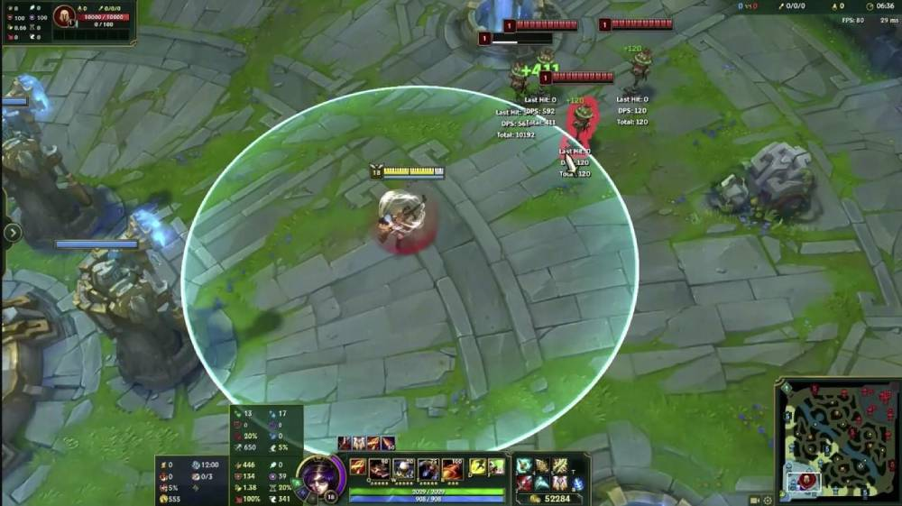

Inspired by the attack range effect(a transparent solid circle with a color gradient, where the color fades from the center to the edge of the circle), as this image shown: \

- `/mesh/solid_circle.obj` is a mesh file which contains a solid circle plane with unit radius, created by Blender.

- Usage:
	- put the `/mesh/solid_circle.obj` as well as `/shader/AttackRange.shader` into UnityEditor.
	- drag `/mesh/solid_circle.obj` into scene.
	- create a new material and use `/shader/AttackRange.shader` in it.
	- set the above new material to the `/mesh/solid_circle.obj` in the scene.
	- voilà, c'est tout.

- Currently the shader is using Quadratic Bezier curves for the alpha, where **alpha=0** is **Point0**, **MiddleAlpha** is **Point1** and **alpha=1** is **Point2**. **"MiddleAlpha"** is user-defined so you can manipulate it in the **Shader Inspector** to play with different gradient. Or you can just replace any other interpolation method for the alpha.

- 